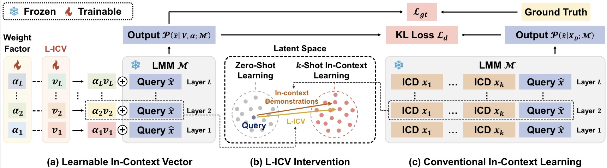

# L-ICV: Learnable In-Context Vector for Visual Question Answering
[](https://opensource.org/licenses/MIT) [](https://arxiv.org/abs/2406.13185)


The implementation of [L-ICV: Learnable In-Context Vector for Visual Question Answering.](https://arxiv.org/abs/2406.13185)

<p align="center"></p>


## News 

- [2024.09.26]🔥 L-ICV is accepted by Neurips2024.
- [2024.07.14] We support more MLLM (Idefics2) for L-ICV.
  - Thanks to [baukit](https://github.com/davidbau/baukit). ‼️ However, we found that it consumes more GPU memory and slow the inference speed. We are attempting to use native PyTorch hooks to address this issue.

## Install 
```bash
conda create -n licv python=3.10

conda activate licv
pip install -r requirments.txt

# For Openflamingo, please use transformers==4.28.1 [beta]

pip install transformers==4.28.1

# Install the lmm_icl_interface
pip install git+https://github.com/ForJadeForest/lmm_icl_interface.git
# Install the baukit
pip install git+https://github.com/davidbau/baukit.git
```

## Model Prepare
- donwload the `idefics-9b` and `idefics2-8b-base` model and put it into `model_weight` folder.
```bash
mkdir model_weight && cd model_weight
huggingface-cli download --resume-download HuggingFaceM4/idefics-9b --local-dir idefics-9b

huggingface-cli download --resume-download HuggingFaceM4/idefics2-8b-base --local-dir idefics2-8b-base
```


## Data Prepare
You need create a new folder named `data` and put the following files into it.
```bash
mkdir data
```


### [COCO](https://cocodataset.org/)
<details>
<summary>Data Preparation</summary>

```bash
mkdir -p data/coco/mscoco2014 && cd data/coco/mscoco2014

# download coco2014 images
wget http://images.cocodataset.org/zips/train2014.zip && unzip train2014.zip
wget http://images.cocodataset.org/zips/val2014.zip && unzip val2014.zip
wget http://images.cocodataset.org/zips/test2015.zip && unzip test2015.zip

cd ../../..
```
</details>


### [VQAv2](https://visualqa.org/)
> We test L-ICV on VQAv2 val set.
<details>
<summary>Data Preparation</summary>

```bash
mkdir -p data/vqav2 && cd data/vqav2

# make sure you have downloaded COCO images

# download questions and annotations
wget https://s3.amazonaws.com/cvmlp/vqa/mscoco/vqa/v2_Annotations_Train_mscoco.zip && unzip v2_Annotations_Train_mscoco.zip
wget https://s3.amazonaws.com/cvmlp/vqa/mscoco/vqa/v2_Questions_Train_mscoco.zip && unzip v2_Questions_Train_mscoco.zip
wget https://s3.amazonaws.com/cvmlp/vqa/mscoco/vqa/v2_Annotations_Val_mscoco.zip && unzip v2_Annotations_Val_mscoco.zip
wget https://s3.amazonaws.com/cvmlp/vqa/mscoco/vqa/v2_Questions_Val_mscoco.zip && unzip v2_Questions_Val_mscoco.zip
```
</details>

### [OKVQA](https://okvqa.allenai.org/)

<details>
<summary>Data Preparation</summary>

```bash
mkdir -p data/okvqa && cd data/okvqa

# download annotations and questions
wget https://okvqa.allenai.org/static/data/mscoco_train2014_annotations.json.zip && unzip mscoco_train2014_annotations.json.zip
wget https://okvqa.allenai.org/static/data/OpenEnded_mscoco_train2014_questions.json.zip && unzip OpenEnded_mscoco_train2014_questions.json.zip
wget https://okvqa.allenai.org/static/data/mscoco_val2014_annotations.json.zip && unzip mscoco_val2014_annotations.json.zip
wget https://okvqa.allenai.org/static/data/OpenEnded_mscoco_val2014_questions.json.zip && unzip OpenEnded_mscoco_val2014_questions.json.zip

cd ../..
```

</details>

### [COCO2017](https://cocodataset.org/) 
> L-ICV also can do ImageCaptioning Task


### Set The `.env` file
```bash
cp .env.example .env
vi .env

##### Then set the following variables
# Please use Absolute Path
RESULT_DIR="/path/to/ICV-VQA/result"
VQAV2_PATH="/path/to/ICV-VQA/data/vqav2"
OKVQA_PATH="/path/to/ICV-VQA/data/okvqa"
COCO_PATH="/path/to/ICV-VQA/data/mscoco"
MODEL_CPK_DIR="/path/to/ICV-VQA/model_weight"
```


## Run
```bash
# Run Idefics-v1-9B on vqav2 with 32 shot
python train.py run_name="vqav2_idefics_icv"\
                icv_module.icv_encoder.use_sigmoid=False\
                icv_module.icv_encoder.alpha_init_value=0.1\
                data_cfg.task.datasets.max_train_size=8000\
                data_cfg.task.datasets.few_shot_num=32\
                data_cfg.bs=8\
                data_cfg.num_workers=10\
                trainer.accumulate_grad_batches=2\
                trainer.devices=4 \
                icv_module.icv_lr=1e-3 \
                icv_module.hard_loss_weight=0.5 \
                data_cfg/task/datasets=vqav2 \
                lmm=idefics-9B\
                trainer.precision="16-mixed" 


# Run Idefics-v1-9B on okvqa with 32 shot
python train.py run_name="okvqa_idefics_icv"\
                icv_module.icv_encoder.use_sigmoid=False\
                icv_module.icv_encoder.alpha_init_value=0.1\
                data_cfg.task.datasets.max_train_size=8000\
                data_cfg.task.datasets.few_shot_num=32\
                data_cfg.bs=8\
                data_cfg.num_workers=10\
                trainer.accumulate_grad_batches=2\
                trainer.devices=4 \
                icv_module.icv_lr=5e-3 \
                icv_module.hard_loss_weight=0.5 \
                data_cfg/task/datasets=ok_vqa \
                lmm=idefics-9B\
                trainer.precision="16-mixed" 


# Run Idefics-v2-9B on vqav2 with 1 shot
python train.py run_name="vqav2_idefics2_icv"\
                icv_module.icv_encoder.use_sigmoid=False\
                icv_module.icv_encoder.alpha_init_value=0.1\
                data_cfg.task.datasets.max_train_size=8000\
                data_cfg.task.datasets.few_shot_num=1\
                data_cfg.bs=8\
                data_cfg.num_workers=10\
                trainer.accumulate_grad_batches=2\
                trainer.devices=4 \
                icv_module.icv_lr=1e-3 \
                icv_module.hard_loss_weight=0.5 \
                data_cfg/task/datasets=vqav2 \
                lmm=idefics2-8B-base\
                trainer.precision="bf16-mixed" 


# Run Idefics-v2-9B on okvqa with 1 shot
python train.py run_name="okvqa_idefics2_icv"\
                icv_module.icv_encoder.use_sigmoid=False\
                icv_module.icv_encoder.alpha_init_value=0.1\
                data_cfg.task.datasets.max_train_size=8000\
                data_cfg.task.datasets.few_shot_num=1\
                data_cfg.bs=8\
                data_cfg.num_workers=10\
                trainer.accumulate_grad_batches=2\
                trainer.devices=4 \
                icv_module.icv_lr=5e-3 \
                icv_module.hard_loss_weight=0.5 \
                data_cfg/task/datasets=ok_vqa \
                lmm=idefics2-8B-base\
                trainer.precision="bf16-mixed" 
```

## Run Inference

```shell
python inference.py run_name="vqav2_idefics_icv" \
                data_cfg/task/datasets=vqav2\
                lmm=idefics-9B

python inference.py run_name="okvqa_idefics_icv" \
                data_cfg/task/datasets=ok_vqa\
                lmm=idefics-9B

python inference.py run_name="okvqa_idefics2_icv" \
                data_cfg/task/datasets=ok_vqa\
                lmm=idefics2-8B-base

python inference.py run_name="vqav2_idefics_icv" \
                data_cfg/task/datasets=vqav2\
                lmm=idefics2-8B-base
```

## Citing this work
```bibtex
@article{peng2024learnable,
  title={Learnable In-Context Vector for Visual Question Answering},
  author={Peng, Yingzhe and Hao, Chenduo and Yang, Xu and Peng, Jiawei and Hu, Xinting and Geng, Xin},
  journal={arXiv preprint arXiv:2406.13185},
  year={2024}
}
```
